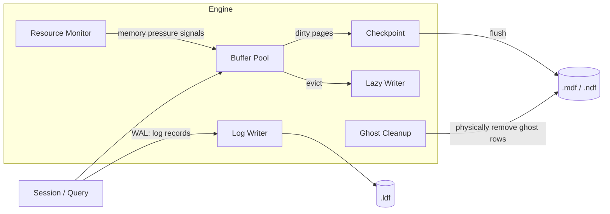

# 📚 SQL Server Internals — SPID \< 50 (Cheat‑Sheet + Labs)

Pakiet repo‑ready pokazujący **wewnętrzne procesy SQL Server (SPID \< 50)** oraz gotowe skrypty do podglądu i nauki: DMV, PerfMon, Extended Events (helpery), fiszki oraz zadania pod VS Code.

## Struktura

```
/
├─ README.md
├─ license/CC-BY-4.0.txt
├─ dmv/
├─ perfmon/
├─ xe/
├─ flashcards/
├─ scripts/
├─ diagram/
└─ .vscode/
```

## Szybki start (VS Code + sqlcmd)

1. Ustaw zmienne środowiskowe (PowerShell):
   ```powershell
   $env:SQLINSTANCE = ".\SQLEXPRESS"   # albo np. "."
   $env:DB = "master"
   ```
2. Otwórz folder w VS Code i uruchom **Terminal → Run Task… → DMV: All SPID \< 50**.

> Alternatywnie:  
> ```powershell
> sqlcmd -S $env:SQLINSTANCE -d master -i .\dmv\all_spid_lt50.sql -W -s ","
> ```

## Co w pakiecie?

- **DMV** — kwerendy „co robią elfy”: `sys.dm_exec_sessions`, `sys.dm_exec_requests`, `sys.dm_os_tasks`, `sys.dm_os_waiting_tasks`, schedulery.
- **PerfMon** — lista liczników: Lazy Writes/sec, Log Flushes/sec, Ghost Cleanup Tasks/sec itd.
- **XE (helpery)** — skrypty do **wyszukania dostępnych eventów** (różnice między wersjami) i **bezpieczny szablon** sesji z ring_buffer.
- **Fiszki** — Markdown + TSV (Anki) dla SPID 1,2,3,4,5,7 oraz klas funkcjonalnych.


## Mini‑mapa: kto jest kim (SPID \< 50)

| SPID | Proces | Rola | Gdzie podejrzeć |
| ---: | --- | --- | --- |
| 1 | System session | Sesja root (rezerwacja engine) | `sys.dm_exec_sessions` |
| 2 | Lazy Writer | Zwalnia strony w Buffer Pool (dirty → MDF) | DMV, PerfMon: Buffer Manager\Lazy Writes/sec |
| 3 | Checkpoint | Flush dirty pages, skraca recovery, stabilizuje log | DMV, XE: checkpoint_* |
| 4 | Resource Monitor | Nadzór pamięci (SQL + OS) | DMV, XE: resource_monitor |
| 5 | Log Writer | Flush log buffer → *.ldf* | DMV, PerfMon: Databases\Log Flushes/sec |
| 7 | Ghost Cleanup | Fizyczne usuwanie ghost records | DMV (migawka), PerfMon: Ghost Cleanup Tasks/sec |
| 11+ | DAC/AG/Replication/SB/FT/etc. | Procesy trybów i usług | DMV/XE specyficzne dla funkcji |

> Uwaga: skład faktycznych SPID\<50 zależy od **wersji** i **włączonych funkcji** (AG, replika, FILESTREAM, XTP). Traktuj tabelę jako przewodnik.

## Diagram (Mermaid)



## Bezpieczna obserwacja

- **DMV snapshoty**: `dmv/all_spid_lt50.sql`, `dmv/os_tasks_waiting.sql`, `dmv/exec_requests_snapshot.sql`.
- **PerfMon**: lista w `perfmon/counters.md` — dodaj do Data Collector Set.
- **XE**: najpierw **znajdź dostępne eventy** (`xe/Find-Events.sql`), potem **stwórz sesję** z szablonu (`xe/Create-InternalsWatch.sql`).

## Nauka z fiszek

- `flashcards/spid_flashcards.md` — gotowe do druku.

---

